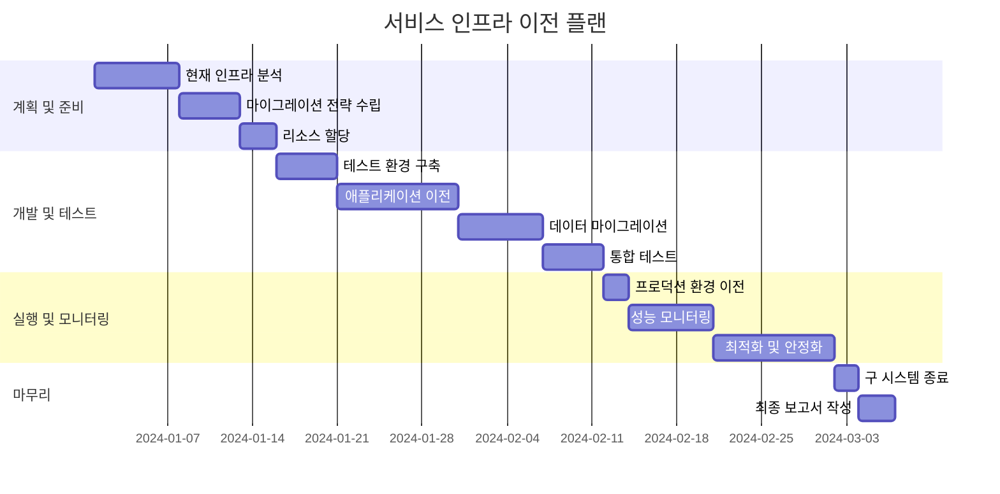

```markdown

```mermaid
gantt
    title 서비스 인프라 이전 플랜
    dateFormat  YYYY-MM-DD
    section 계획 및 준비
    현재 인프라 분석       :a1, 2024-01-01, 7d
    마이그레이션 전략 수립 :a2, after a1, 5d
    리소스 할당            :a3, after a2, 3d
    section 개발 및 테스트
    테스트 환경 구축       :b1, after a3, 5d
    애플리케이션 이전      :b2, after b1, 10d
    데이터 마이그레이션    :b3, after b2, 7d
    통합 테스트            :b4, after b3, 5d
    section 실행 및 모니터링
    프로덕션 환경 이전     :c1, after b4, 2d
    성능 모니터링          :c2, after c1, 7d
    최적화 및 안정화       :c3, after c2, 10d
    section 마무리
    구 시스템 종료         :d1, after c3, 2d
    최종 보고서 작성       :d2, after d1, 3d
```
```
